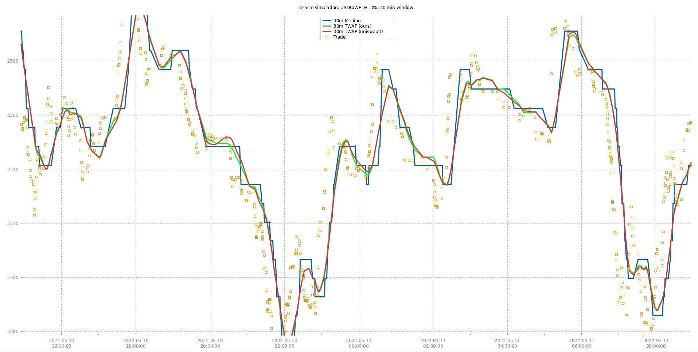
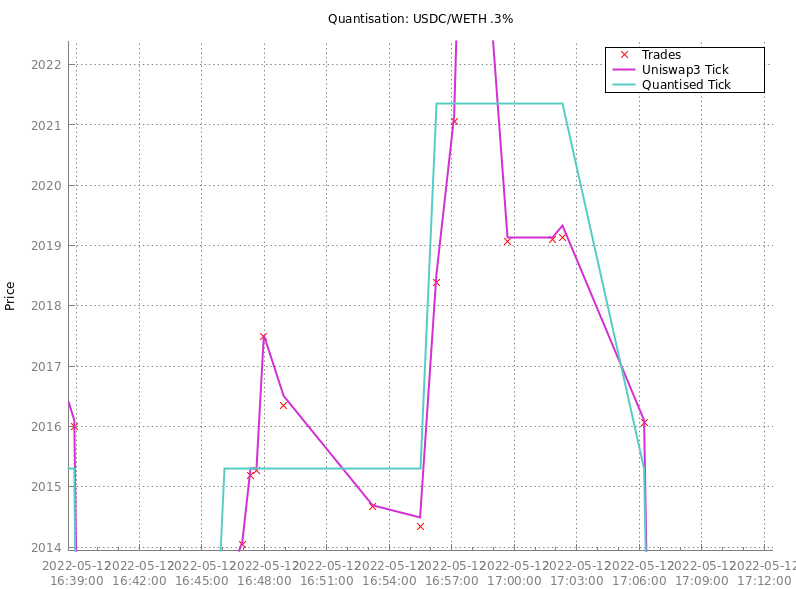
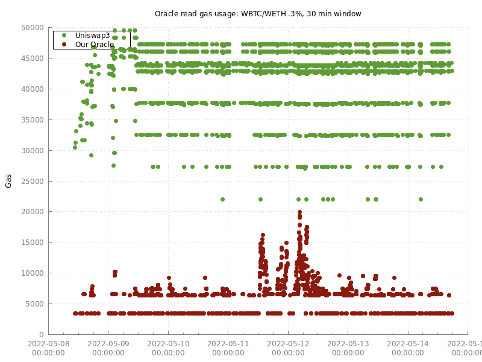
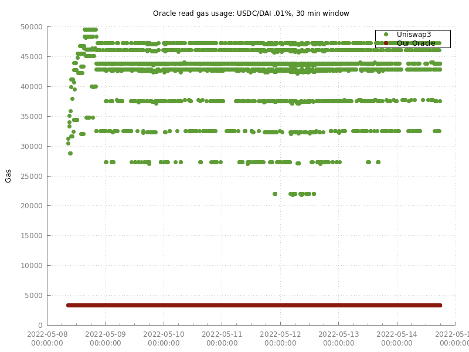
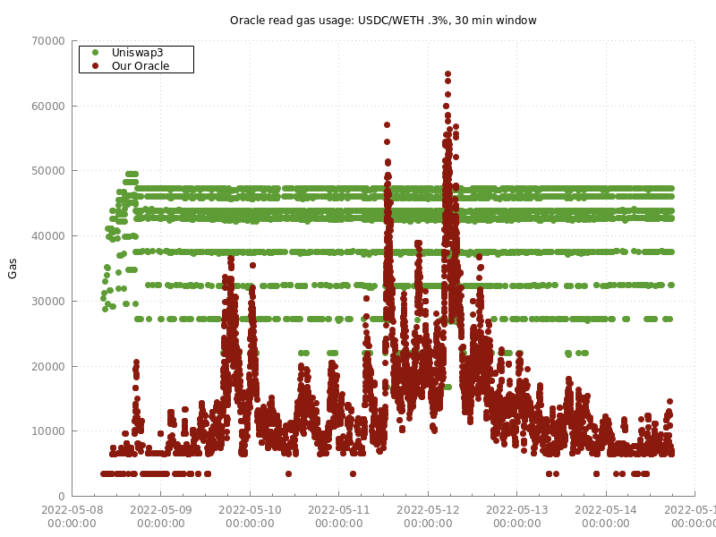
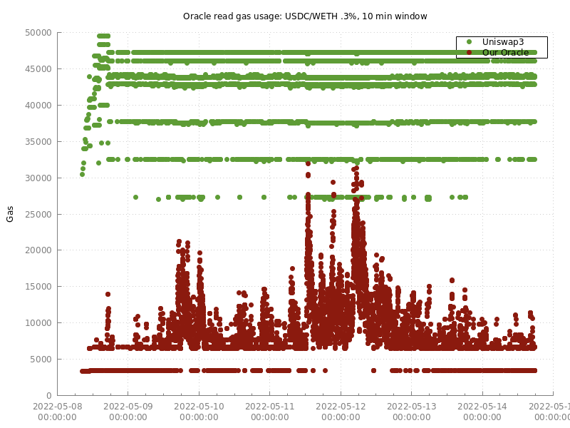
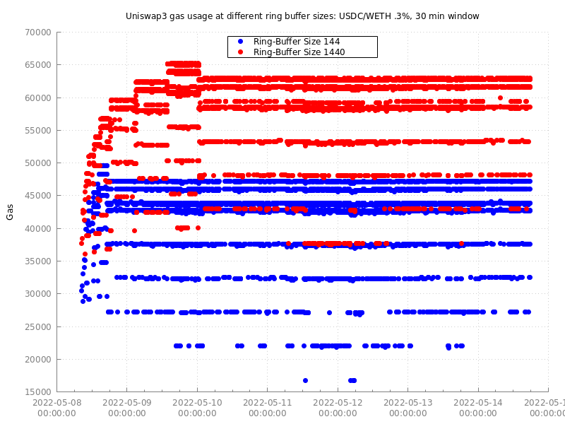

# Median Oracle

This is a proof-of-concept smart contract that proposes a new on-chain price oracle design. It is intended to perform the same function as Uniswap TWAP (Time-Weighted Average Price) oracles: digest the information resulting from trades on an AMM and allow for efficient querying of past prices in a way that mitigates the [snapshot problem](https://blog.euler.finance/prices-and-oracles-2da0126a138) (for example manipulation with flash loans).

While Uniswap oracles return arithmetic (Uniswap2) or geometric (Uniswap3) price averages within an arbitrary window of time, this oracle returns the median price *and* the geometric TWAP within the window.

The following plot is from our simulation, using real Swap events from the Uniswap3 USDC/WETH 0.3% pool:

The 30 minute median price tracks the 30 minute TWAPs fairly closely. Both are lagging indicators that effectively smooth out the rough spikes caused by trading activity, although the TWAP glides over smooth curves whereas the median jumps between levels. The TWAPs computed by our oracle don't precisely match those computed by Uniswap3 due to price [quantisation](#quantisation).

The contract code is available in this repo in the file `contracts/MedianOracle.sol` .

<!-- TOC FOLLOWS -->
<!-- START OF TOC -->
* [Motivation](#motivation)
  * [TWAP](#twap)
  * [Median Filtering](#median-filtering)
  * [Pros and Cons of Median Prices](#pros-and-cons-of-median-prices)
  * [Gas Usage](#gas-usage)
* [Design](#design)
  * [Limitations](#limitations)
  * [Quantisation](#quantisation)
  * [Ring Buffer](#ring-buffer)
    * [Updates](#updates)
    * [Binary Search](#binary-search)
    * [Linear Search](#linear-search)
  * [Availability](#availability)
* [Simulation](#simulation)
  * [Window Sizing](#window-sizing)
  * [Binary Search Overhead](#binary-search-overhead)
  * [Worst-Case Growth](#worst-case-growth)
* [Future Work](#future-work)
* [Author and Copyright](#author-and-copyright)
<!-- END OF TOC -->

## Motivation

### TWAP

Various attacks against TWAPs have been [extensively analysed](https://github.com/euler-xyz/uni-v3-twap-manipulation/blob/master/cost-of-attack.pdf). In most cases TWAPs provide adequate security. TWAPs are *not* vulnerable to "zero-block" attacks where an attacker manipulates a price but then moves it back in the same block. This is because 0 time passes within a block's execution, so the time-weight component is 0.

However, there are a some concerns with TWAP's long-term security properties.

So called "one-block" attacks are when an attacker manipulates a price and then arbitrages it back in the next block to recover the funds at risk before anybody else has a chance to. This is possible (but risky) when using flashbots or selfish mining (where a miner tries to mine two blocks in a row but withholds the first one until the second is found). However, in order for a one-block attack to significantly modify the TWAP, the price must be moved to a very high (or very low) level, because it needs to outweigh all the other prices in the window. One of the advantages of geometric over arithmetic averaging is that price security is symmetric in up and down directions (or, equivalently, when the pair is inverted).

"Multi-block" attacks are when an attacker manipulates a price and then attempts to hold it at this manipulated price for multiple blocks, either sacrificing funds to arbitrageurs or censoring transactions in some manner. These attacks don't require moving the price as far as in a one-block attack since the manipulated price will have a larger time-weight.

In both of these cases, a TWAP will start to move immediately, and the speed at which it moves is related to how large the price manipulation is. As soon as the averaged price reaches a target level, an attack can begin by, for example, depositing price-inflated collateral into a lending protocol.

The exact attacker threat model for these attacks is still being determined. Certainly it includes attackers who can control or influence multiple blocks in a row. Miners have theoretically always had this ability, and systems like Flashbots have made it more accessible to everyone else.

Furthermore, with Ethereum's move to Proof of Stake, the mechanism of who creates blocks will change. Rather than being chosen effectively at random each block as with Proof of Work, validators will know ahead of time exactly when they will be able to create a block and can choose to time an attack based on that. What's more, sometimes by chance validators (or colluding groups of validators) will find they are permitted to create multiple blocks in a row. There are also potentially relevant changes coming to flashbots such as "MEV Boost" which could allow attackers to control entire block bodies and more.

All of this is to say that we think the time is now to being investigating alternate oracle designs that will improve security in the presence of price-manipulators who are also participants in blockchain consensus.

### Median Filtering

Median filtering is often used in image processing because it is very effective at removing [salt-and-pepper](https://medium.com/analytics-vidhya/remove-salt-and-pepper-noise-with-median-filtering-b739614fe9db) noise. This type of noise is caused by impulses, such as a cosmic ray, or a burned out camera pixel. By throwing out outlying pixels from the image and replacing them with their more reasonable-valued neighbours, images can be cleaned up with minimal distortion. Because the impulses are entirely thrown out, their presence has no impact on the output image. This is in contrast with other types of filters that incorporate the impulses into some kind of average.

For the same reason, our proposed price oracle uses median instead of mean as its foundation. Imagine that every second we pushed the current price onto a big array. To query a window of N seconds, we would take the last N prices, sort them, and return the middle (median) price. If the price has been stable for some period of time, this means that there is no value you can move the price to that will impact the median in the following block. What's more, even if you manipulate the price and are able to hold it at the manipulated level, you will need to sustain this manipulated price for N/2 seconds for it to have an impact.

Of course, recording a price every second is impractical, so it makes more sense to think of each time interval as a stick, where the length corresponds to the amount of time the price was in effect. The sticks are sorted according to price (either ascending or descending, it doesn't matter) and arranged end-to-end in a big line. The stick that overlaps the mid-point of this big line provides the oracle's output price. In technical terms, this is called the "weighted median", where weight corresponds to stick length.

### Pros and Cons of Median Prices

Median prices cannot be significantly influenced unless an attacker can control the block-ending prices of around N/2 blocks in the window. If we want a 30 minute window then an attacker would need to control 72 blocks within a 144 block period (assuming 12.5 second block times, and that the price has been otherwise stable within the period). This is in contrast to TWAP, where a few block-ending prices (or even one) can manipulate the oracle output to a dangerous level, if the manipulations are large enough.

However, once the median switches over to the new manipulated price after N/2 blocks, the output oracle will jump immediately to that price level. By contrast, the TWAP would still be between the original price and the new manipulated level.

Additionally, when there is a "legitimate" movement in price, it will take longer to be reflected in the median, while the TWAP will immediately begin to transition to the new level. TWAP price movements are also smooth over time (with per-second granularity) whereas median prices jump between levels at seemingly arbitrary points in time. This smoothness is sometimes a desirable feature, for example when implementing Dutch auction mechanisms (as in Euler's Liquidation module).

Because neither TWAPs nor median prices are better in all circumstances, our oracle computes both of them at the same time, and allows the caller to choose which one (or both) to use.

### Gas Usage

For many applications, the gas required to read the oracle is a major expense. For example, in lending markets like Compound/AAVE/Euler, a user's net assets and liabilities may need to be computed by a contract to determine if a requested action is permitted, and each of these may need an up-to-date price.

Although Uniswap3's gas usage is often acceptable, systems that use centralised and [non-objective](https://blog.euler.finance/prices-and-oracles-2da0126a138) oracles like Chainlink currently have a competitive advantage. Ideally gas efficiency of our oracle would match or exceed Chainlink's.

There are various implementation challenges with computing the median on-chain. First of all, the gas overhead to update the price oracle (ie during a swap) must be minimised so as not to force swappers to maintain the oracle (which they likely don't care about). In this design, we have assumed that update gas costs must remain constant with respect to the number of observations mantained by the oracle, and should involve no more than 1 cold storage slot access (as with Uniswap3). This rules out maintaining the set of observations in any kind of sorted data-structure. Therefore the weighted median must be entirely computed during oracle read time.

## Design

### Limitations

For reasons that will become clear in the following sections, our oracle has a few fundamental API limitations compared to Uniswap:

* The minimum price resolution available is 0.3%, giving a maximum error of 0.15% (see the [Quantisation](#quantisation) section)
* The maximum time window that can be requested is 65535 seconds (about 18 hours 12 minutes)
* The time window must always be aligned to the present -- you cannot query historical windows
* Only price can be queried, not pool liquidity

Additionally the proof of concept has a few implementation limitations that will be addressed in the future:

* The ring buffer is not resizable
* The storage of ring-buffer meta-data is not packed optimally, and will need to be integrated with the application contract

### Quantisation

Uniswap3 has a clever innovation that involves encoding prices into "ticks". These are essentially logarithms of the prices scaled and truncated in such a way that they can be efficiently stored. In Uniswap3's scheme, any tick can be represented by a number between -887272 and 887272 inclusive. This is 20.759 bits of information so it can be stored in an `int24` data-type which occupies only 3 bytes. Since there are many more possible prices than there are ticks, by the pigeonhole principle multiple prices can map to the same tick, and converting a price into a tick loses information.

This operation -- lossily compressing a large input domain down to a smaller output range -- is called quantisation. Our oracle design builds upon Uniswap3's tick specification (because we hope that in the future it could be adapted to work with... Uniswap4?), but adds another level of quantisation.

Given a tick value, we divide it by 30 and take the floor, giving a number between -29576 and 29575 inclusive. This is 15.8521 bits of information and can therefore pack into an `int16` (2 bytes). In order to recover an approximation of the original tick, we multiply by 30 and add 15. In signal processing jargon, this is called a mid-riser quantisation, since if you imagine the plot of inputs to outputs being a staircase, the 0 input is right at the edge of a stair (the "riser"). In our case, an input tick of 0 will remap to a tick of 15, and a tick of -1 to -15.

Although packing a tick into 2 bytes has significant gas benefits (as we'll describe later), it reduces the precision of prices that can be tracked. While a Uniswap3 tick is always guaranteed to be no more than 0.005% away from the original price, our quantised ticks can be up to 0.15% away.

So, our oracle trades off price precision for gas efficiency. In real-world AMM usage, price movements are often relatively small. This may be due to small swaps or perhaps larger swaps that are arbitraged back in the same block to nearly the original price. With our oracle, price movements that don't change the quantised tick do not result in an oracle update. This reduces the work needed during reads because there are fewer slots to scan (see the [simulation](#simulation) of USDC/DAI for a stark example of this). Note that Uniswap3 does this as well, but at 0.01% granularity instead of 0.3%. Most Chainlink oracles effectively have a price granularity of 1%.

The price error introduced by quantisation can be observed by zooming in on a section of our simulation's graphs. At this zoom, we can see quantised levels as flat plateaus that only roughly approximate the trade prices. The Uniswap3 ticks are much more precise, but differences can be seen with them also:

One possible worst-case trading pattern for our oracle would be a pool that oscillates across a tick boundary frequently. Even though the price movements would be small, each would involve a new entry added to the ring buffer. See the [Future Work](#future-work) section for an idea on how to mitigate this.

### Ring Buffer

#### Updates

Like Uniswap3, our proposed oracle uses a ring buffer. Updates in both systems work the same in that they will overwrite older values, meaning that once somebody has paid the gas to populate the entries, no storage writes will involve writing to a storage location containing 0 (which is particularly expensive).

Unlike Uniswap3, however, we pack multiple observations into a single slot. Each 32-byte slot is divided into 8 sub-slots of 4 bytes each. The first two bytes of a sub-slot contain the [quantised](#quantisation) tick and the second two bytes contain the number of seconds since the previous update.

Because of how time is encoded, this means that an observation cannot be longer than 65535 seconds (a value of 0 seconds is invalid, and is reserved to indicate an uninitialised sub-slot). This results in a limitation of the oracle, in that windows of larger than 65535 seconds (about 18 hours 12 minutes) cannot be queried. Price durations over 65535 seconds [saturate](https://en.wikipedia.org/wiki/Saturation_arithmetic) to 65535, which is acceptable since a window can never be longer than that, meaning processing is guaranteed to stop when it encounters an observation with this age.

One consequence of this encoding is that pre-populating the ring buffer ("increasing the cardinality" in Uniswap terms) requires 1/8th the gas compared to Uniswap3, per observation.

#### Binary Search

Uniswap3's oracle has the advantage of a lower worst-case bound on gas usage. In addition, its gas usage is more predictable. The way that it works is by loading the first and last slots in the ring buffer to check boundary conditions, and then binary searching the ring buffer to find the newest accumulator record older than the requested window, and then interpolating the needed value:

Because binary search halves the search space on every load, this method will make approximately `log2(N)` storage loads, where `N` is the size of the ring buffer. See [Binary Search Overhead](#binary-search-overhead) for an example of how increasing the size of the ring buffer will increase the cost of oracle reads.

#### Linear Search

Our oracle's read mechanism is entirely different from Uniswap3's. Because we need to process each element in our window, we have decided to not use accumulators at all, and instead aggregate all the needed data as we scan, with a linear search "backwards" (most recent observation first) in the ring buffer:

First we check if the time since the last update is older than the window. If so, it simply returns a cached copy of the current tick. Both of these values will be packed into a shared storage slot of the containing smart contract, so in this case no ring buffer access is needed whatsoever.

Otherwise, a memory array is created that will store observations from the ring buffer. If the current price has been in effect for a non-zero amount of time, then a "virtual" observation is pushed onto the memory array representing the elapsed time at the current price.

The oracle then proceeds to read backwards in the ring buffer until it finds an observation older than or equal to the requested window. Because we keep a cached value of the current ring buffer entry on the stack, 8 elements are fetched with each storage load. Each element read is pushed onto the memory array. If adding the last element onto the array pushes the total observation time over the window length, it is artificially shortened. If there are not enough observations to satisfy the requested window, then the requested window parameter *itself* is shortened. This means that after loading from the ring buffer, the sum of the durations of all elements in the memory array is exactly equal to the (possibly shortened) window length.

At this point we have an unordered pile of sticks in our memory array. Our original description of weighted median called for sorting them, however that would involve some unnecessary work. We just want to find the element that overlaps the middle of the total length of the stick: we don't care about the orderings of the sticks before or after that point.

There are various solutions to this problem, but our proof of concept uses the standard textbook solution (literally -- see exercise 9-2 in [CLRS Algorithms](https://www.amazon.com/Introduction-Algorithms-fourth-Thomas-Cormen/dp/026204630X/)). It implements a variation of QuickSelect, which is itself a variation of QuickSort. While QuickSort partitions its input into two segments and then recurses into each one, QuickSelect only recurses into the segment where the position of the element it is seeking resides (which it knows because it has determined the index of the pivot element). This allows a position to be selected in O(N) time, rather than O(N log(N)) as with QuickSort. The variation required for weighted median simply chooses which direction to recurse based on the accumulated weights on one side (compared with half of the total weight), rather than an absolute position (which is unknown).

As always, there are a few tricks involved getting this to work efficiently on-chain:

* Solidity doesn't actually support dynamic memory arrays, so unfortunately to do this in one pass we need to use a bit of assembly. This works by saving the free memory pointer ahead of time and then storing each element into unused space. At the end we increase the free memory pointer and store the original value (and length) into a memory array. Of course we need to ensure that no other memory allocations occur during the construction.
* Each element of the memory array is encoded specially. The observation's tick is converted into a non-negative integer by adding a large value to it, and then this value is cast to a `uint` and then shifted left, leaving lower order bits free to contain the duration of the observation. This way, sorting is possible by simply using the regular `>` and `<` operations on the `uint` datatype, and moving the `uint`s automatically carries along the durations. Empirically, unlike storage, packing elements in memory beyond the word size is usually not worthwhile.
* In the weighted median implementation, to reduce overhead as much as possible we use unchecked "pointer arithmetic" instead of array indices. This makes the code a bit harder to follow, for example because we need to do `i += 32` instead of `i++`, but reduces gas usage by over 30%.

Once we have found the element that overlaps the weight mid-point, it is simply a matter of extracting its tick from the memory encoding, unquantising it, and returning the result.

### Availability

Another difference between Uniswap3 and our proposed oracle is how requests for window lengths that cannot be satisfied are handled. This comes up when a ring buffer is too short and the required data has already been overwritten.

In this case, Uniswap3 simply fails with the error message `OLD`. This can be problematic for some systems that try to maintain system availability. For example, liquidating a user on a borrowing platform may involve querying the prices for all the user's assets and liabilities. If users can exhaust the ring buffers for one of their tokens, then they could cause liquidations to fail and therefore prevent themselves from being liquidated.

Sometimes systems would actually be willing to use a shorter window if available. The best way I have found to do this on Uniswap3 is to optimistically query for the ideal window with `observe()`. If that fails with `OLD`, then call `slot0()` on the pool to get the current `index` and `cardinality` and use these parameters to lookup the oldest available observation with `observations()` (and handle the case where that observation is uninitialised), then finally call `observe()` again with the timestamp of this oldest available observation.

To simplify this, and avoid the extra gas costs, our oracle returns the size of the longest available window, along with the median and TWAP for that (shortened) window. This leaves the decision of what to do up to the calling code. If the window is adequate then the results can be used, otherwise the transaction can be reverted.

## Simulation

In order to analyse our proposed oracle, we have constructed a simulation. We downloaded all the Uniswap3 `Swap` logs for various common pairs on the Ethereum mainnet, and replayed them in a test environment. The test environment performs the implied pricing oracle updates against our oracle and a stripped down version of Uniswap3 which does nothing except for update the price oracle. This allows us to compare the current price to the median and TWAP, as well as examine gas usage between the two systems.

The following plots in this section show the cost to read the oracles around the time of the Great Crypto Crash of May 12th, 2022. This period of time was chosen because there was an extreme amount of price activity and trading volume, which are the worst-case conditions for our oracle. Both Uniswap3 and our oracle have their ring buffer sizes set to 144. Our oracle is computing TWAP and median price, where Uniswap3 is computing only TWAP.

* The USDC/DAI pair illustrates the best-case scenario for the median price oracle. In this case, the price almost entirely remained within a  0.3% quantisation, so reads could be serviced with either 1 or 2 SLOADs.
* USDC/WETH during the crash is the worst behaviour we have simulated with our oracle. Note that the Uniswap3 gas costs are understated: This pair actually has a ring buffer of size 1440 on mainnet, so in real life its costs are [much higher](#binary-search-overhead).

### Window Sizing

One commonly cited advantage of centralised oracle systems like Chainlink is that they can respond to price movements faster than can TWAPs. This is true, but in practice isn't as much of an issue as is implied, for reasons outside the scope of this analysis.

As described above, the issue with TWAPs is they need to be sufficiently long in order to have many "good" samples out-weigh the presumably few "bad" samples. However, with median oracles, "bad" samples, or to be more neutral, "outliers", do not have significant impact on the output price until their time-in-effect approaches half of the window size.

Because of this, we have reason to believe that median oracles can support shorter windows than TWAPs while maintaining equivalent security. If true, this would have two benefits:

* Legitimate price movements are reflected in the oracle output faster, leaving shorter opportunities to attack protocols with stale prices
* Shorter windows reduce worst-case gas consumption

To demonstrate the second point, we re-ran the USDC/WETH example above with a 10 minute window instead of a 30 minute window. There was a significant improvement, and even at the peak of the crash the highest gas usage remained well below typical Uniswap3 costs: 

How much shorter the windows can be still needs to be researched. It will be especially important to create a detailed attacker threat model considering the changes resulting from Proof of Stake, MEV Boost, etc.

### Binary Search Overhead

As described above, the larger the ring buffer grows in Uniswap3, the higher the gas costs for price reads will be. For example, here is the simulation of Uniswap3's oracle given two different ring buffer sizes: 144 and 1440 (the current cardinality for USDC/WETH .3% at the time of writing). Both simulations are querying a 30 minute window:

The initial data is skewed since the buffer is being populated. Once the horizontal bands start we are at the steady state. We haven't investigated this distribution in detail, but believe the bands have to do with how many iterations the binary search requires. By contrast, our proposed oracle is not affected by larger ring buffer sizes (assuming that the desired window is satisfiable).

### Worst-Case Growth

The major disadvantage of our oracle, aside from the API limitations described above, is that its worst-case gas usage is higher that Uniswap3's. Even though in nearly every real-world situation we have simulated our oracle uses less gas than Uniswap3, we should carefully consider the worst-case, which could arise in the following circumstances:

* Extreme market volatility, during which very high gas costs could be especially harmful (users trying to close positions, etc)
* Adversarial price activity designed to cause expense/inconvenience to oracle consumers (ie, users trying to prevent liquidation of their accounts)

There are two primary cost centres in our oracle design:

1. Loading the required ring-buffer entries from storage into memory
1. Finding the weighted median with QuickSelect

The following diagram shows how the cost of querying the oracle grows versus the number of ring buffer elements it needs to access. Each element represents a 0.3% or greater price movement from the previous block.

The "Average only" line was created with a modified version of the oracle that doesn't compute the median at all. The "Best Case" line uses pre-sorted price movements so the least possible amount of work needs to be performed by QuickSelect. Finally, the "Random" line uses a random shuffling of prices, to better represent typical costs:

In the above graph a distinct "stair-case" pattern can be seen in the Average and Best Case lines. Each step represents an additional SLOAD from the ring buffer (since 8 elements are packed per storage slot).

Another concern with QuickSelect (and the QuickSort family in general) is that certain specially crafted inputs can cause the algorithm to degrade to `O(N^2)` performance, depending on how the "pivot" element is selected:

This behaviour will almost never arise naturally, so it would need to be an adversarially selected input. Our plan to deal with this is to have the pivot elements selected at random (a very common implementation technique with QuickSort). The randomness would be sourced from a PRNG seeded with the hash of the following:

* Previous block hash: So that an attack is only applicable for a single block
* `msg.sender`: So that an attacker can't target multiple people at once

One approach that oracle consumers can take is to limit the gas available for an oracle read. If it exceeds a gas allowance then the transaction could be aborted, or other action taken. This is only useful for contracts that can accept some [unavailability](#availability) from their price feeds.

Alternatively, we could add a ring buffer entry `limit` parameter to the API. If this limit is hit, then the backwards scan will stop and the results for a shorter window will be returned instead.

## Future Work

* The ring buffer is not currently resizeable, however this is a relatively simple change and can be done in the same way as Uniswap3.
* In order to prevent the issue of prices oscillating around a quantised tick boundary and causing frequent appends to the ring buffer, a possible solution may be to look back one additional entry when applying a price update where the price has only moved one tick (and perhaps only if we're *not* on a storage slot boundary). If the previous entry is the same tick as the new tick, the most recent entry in the price oracle could be updated to account for the passed time, and then swapped with the previous entry. This would very slightly skew the calculated median (by at most one tick), but probably would not be noticeable in practice.
* Our initial design had a "threshold" parameter that could be specified when reading the oracle. This would further quantise the data after reading from the ring buffer in order to coalesce nearby ticks together, further trading off price accuracy for gas efficiency. This might benefit from future study.

## Author and Copyright

Doug Hoyte

(C) Euler XYZ Ltd.

The code is currently unlicensed, but will be released under an open source license in the near future.
